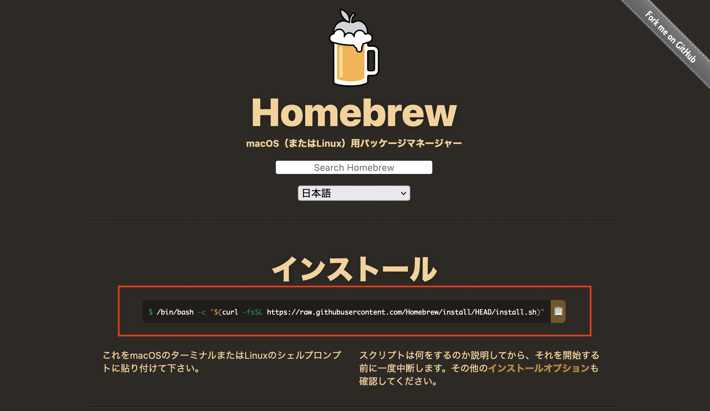
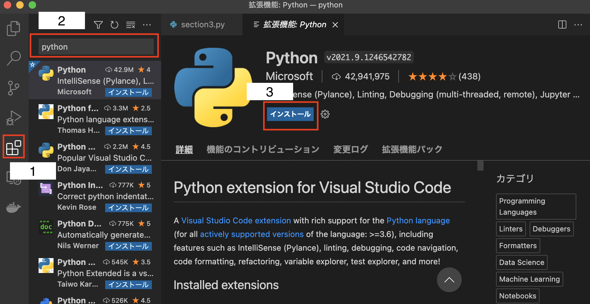
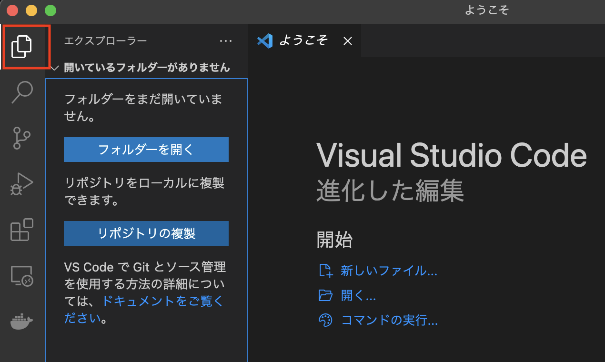
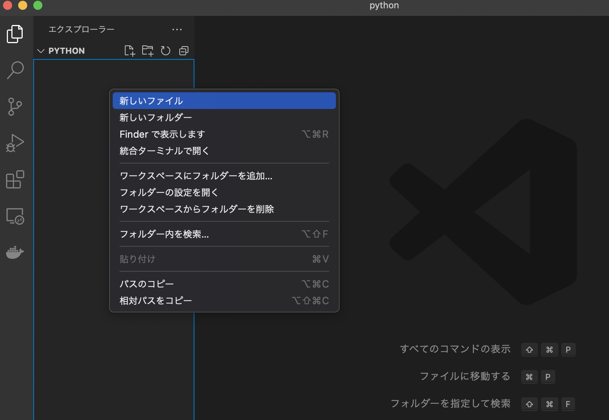
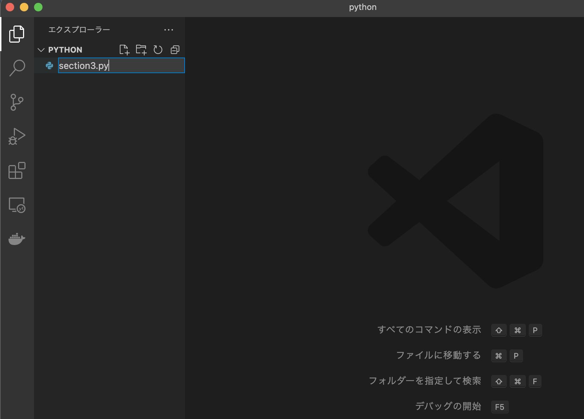
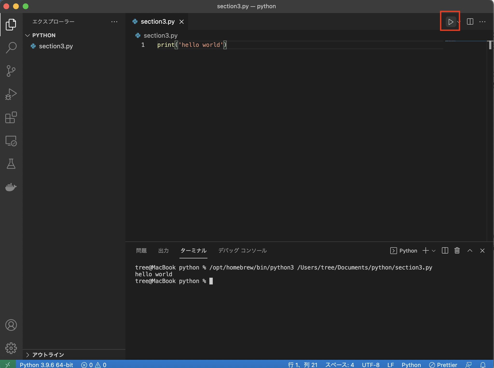
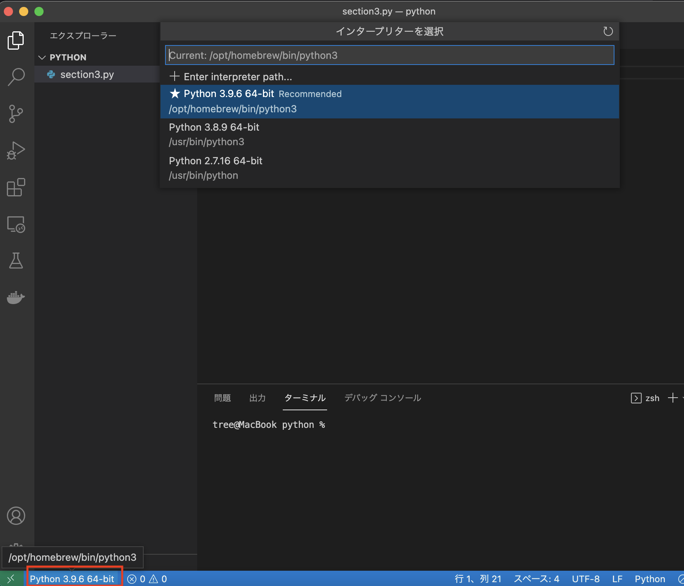

# 第 3 節 スクレイピングのためのpython基礎

Pythonを使ってブラウザを操作するために必要なpythonの基礎知識

## 1. 環境構築（Homebrew）
Homebrewはソフトウェアの導入を単純化するパッケージ管理システムのひとつです。
pythonの環境構築だけでなくスクレイピングするために必要な環境構築にも利用します。

https://brew.sh/index_ja

リンク先から赤枠のコマンドをコピーしてターミナルに貼り付けて実行してください


インストール完了後にこちらのコマンドが実行できれば完了です
```
brew --version
```

## 2. 環境構築（python）
Homebrewを使ってpythonをインストールします

コマンドラインに貼り付けて実行してください
```
brew install python3
```

インストール完了後にこちらのコマンドが実行できれば完了です
```
python3 -V
```

## 3. 環境構築(IDE)
コードエディターはVisual Studio Code(VSCode)を利用します

PCにインストールされていない場合は最新のVSCodeをインストールしてください。

https://azure.microsoft.com/ja-jp/products/visual-studio-code/

1. VSCodeを起動したら左側のバーにある赤枠1をクリックしてください
2. 出てきた検索窓（赤枠2）に「python」と入力して一番上に出てきたPythonをクリック
3. インストールをクリック（赤枠3）


## 3. 環境構築(開発ファイル)
pythonのコードを書くファイルを用意します。

1. 赤枠の部分をクリックして出てくる「フォルダーを開く」をクリックしてコードを置く任意のフォルダを選択してください

2. 開かれたフォルダの上で右クリックして「新しいファイル」をクリック

3. 第３回なので「section3.py」というファイルを作成します

4. 開かれたエディターに↓を入力

```
print('hello world')
```

画像右上にある赤枠の部分をクリックしてプログラムを実行



画面下にあるコンソールに「hello world」が表示されれば環境構築完了です


## Tips
### VSCodeでpythonがうまく使えない時
VSCodeがインストールしたpythonを参照できているか確認しましょう


1. 適当なpythonのファイルを開きます
2. その状態で画面左下にある赤枠の部分をクリックします
3. インタープリターを選択に出てきた中からpython3がついているものを選択してください



