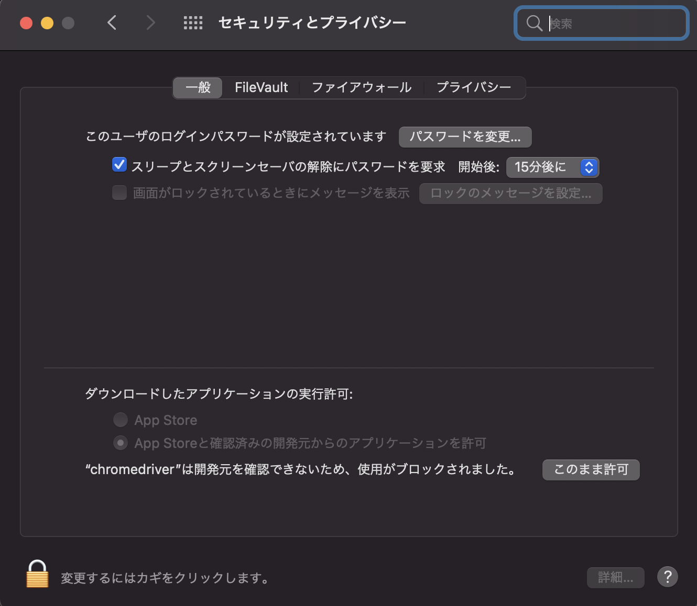

# 第 4 節 スクレイピングのための環境構築


Pythonを使ってブラウザを操作するために必要な環境を構築していきます

## 1. ブラウザの準備
本講座ではPythonでChromeを操作します。

PCにインストールされていない場合は最新のChromeをインストールしてください。

https://www.google.com/intl/ja_jp/chrome/


## 2. brewのインストール
chromedriverのインストールにbrewを利用するのでbrewを導入していない場合はbrewをインストールしてください

https://brew.sh/index_ja


## 3. chromedriverのインストール
chromeをpythonから操作するために必要なchromedriverをbrewを使ってインストールしてください
```
brew install chromedriver
```

## 4. seleniumのインストール
seleniumというライブラリを使ってwebdriverを制御して自動操作を行います。

```
pip3 install selenium
```

## 5. 環境構築の確認
### pythonでブラウザを起動する
```python
from selenium import webdriver
from time import sleep

# ブラウザを開く
driver = webdriver.Chrome()

# 表示されたのを確認するために５秒処理を止める
sleep(5)

# ブラウザを閉じる
driver.quit()
```

## Tips
### 起動時にエラーが出た時 その1

このようなエラーが出た場合は許可を与える必要があります。



システム環境設定 > セキュリティとプライバシー に移動すると「chromedriverは開発元を確認できないため、使用がブロックされました。」というメッセージが表示されているのでこのまま許可をクリックしてください。


### 起動時にエラーが出た時 その2
このようなエラーが出た場合はPCにインストールされているChromeとchromedriverのバージョンが一致していません。
```
selenium.common.exceptions.SessionNotCreatedException: Message: session not created: This version of ChromeDriver only supports Chrome version 92
```

その場合はこのコマンドでchromedriverを最新版にしてください
```
brew upgrade chromedriver
```

