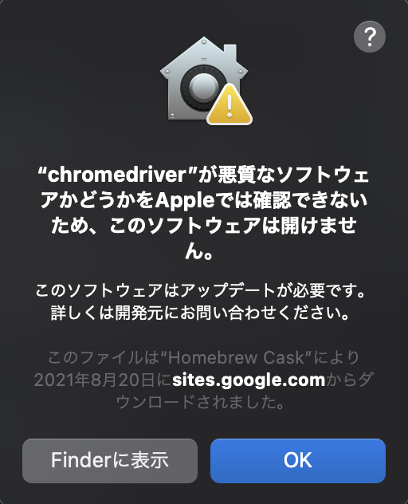

# 第 4 節 スクレイピングのための環境構築

## 目的

Python を使ってブラウザを操作するために必要な環境を構築する

## 学び方

メインテーマであるブラウザ操作に必要な環境構築のパートなので、実際に手を動かしながら進めてください。

## 1. ブラウザの準備

本講座では Python で Chrome を操作します。

PC にインストールされていない場合は最新の Chrome をインストールしてください。

https://www.google.com/intl/ja_jp/chrome/

## 2. brew のインストール

chromedriver のインストールに brew を利用するので導入していない場合はインストールしてください

https://brew.sh/index_ja

## 3. chromedriver のインストール

chrome を python から操作するために必要な chromedriver を brew を使ってインストールしてください

```
brew install chromedriver
```

## 4. selenium のインストール

selenium というライブラリを使って webdriver を制御して自動操作を行います。

```
pip3 install selenium
```

## 5. 環境構築の確認

### python でブラウザを起動する

```python
from selenium import webdriver
from time import sleep

# ブラウザを開く
driver = webdriver.Chrome()

# get内に指定したサイトを開く
# TODO 他のサイトも開いてみましょう
driver.get('https://centinel.jp/')

sleep(5)

# ブラウザを閉じる
driver.quit()
```

## Tips

### 起動時にエラーが出た時 その 1

このようなエラーが出た場合は許可を与える必要があります。




システム環境設定 > セキュリティとプライバシー に移動すると「chromedriver は開発元を確認できないため、使用がブロックされました。」というメッセージが表示されています。

メッセージの右にある「このまま許可」をクリックしてください。

### 起動時にエラーが出た時 その 2

このようなエラーが出た場合は PC にインストールされている Chrome と chromedriver のバージョンが一致していません。

```
selenium.common.exceptions.SessionNotCreatedException: Message: session not created: This version of ChromeDriver only supports Chrome version 92
```

その場合はこのコマンドで chromedriver を最新版にしてください

```
brew upgrade chromedriver
```
