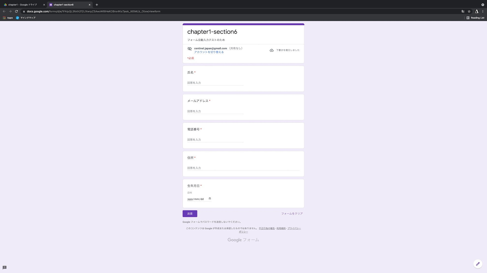
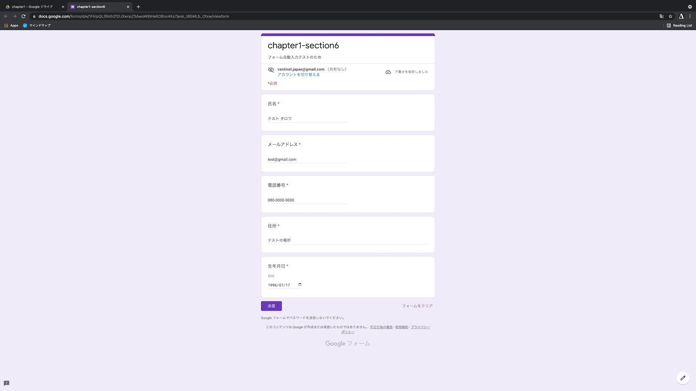
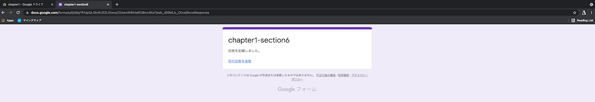

# 第 6 節 抽選フォームへの入力を自動化しよう

## 目的

主に 2 つあります。

1. 2~4 節で学んだ知識をもとに実際に目に見える形の成果物を作り、この動画を見て学んでいる皆さんのモチベーションを上げること
2. 成果物を増やすことで、それが新たなプログラムを作るための足掛かりにでき、さらにスキルを伸ばすことができるという良い流れを作る

## 学び方

複数回動画を見て学んでいただくのがおすすめです。

1 回目は深く考えずコピペしながら進んでいき、実際にプログラムを動かしながら楽しさや驚きを感じて欲しいです。
2 回目以降は各所でやっていることの意味を考えながら、自分で改造したりして理解を深めることでより自分の知識にすることができます。

今回お見せしている資料は概要欄に貼っておりますので、ぜひご利用ください。

### 完成形

```sh
git clone https://github.com/centinel-jp/programming_lesson.git
cd programming_lesson/chapter1/section6/
python3 section6.py
```

### 今回のターゲット

Google Form を使用します。

フォームを作成するのが面倒な方は、以下にフォームを用意してありますのでそれを利用していただければと思います。
[リンク](https://docs.google.com/forms/d/e/1FAIpQLSfoth2f2lJXwrpZSAwoW8iHeKOBnx4Ks7jesk_t65MLb_Otxw/viewform)

# 実装前の準備

## 1. 何を実現したいか考える

1. フォームページを開く

https://docs.google.com/forms/d/e/1FAIpQLSfoth2f2lJXwrpZSAwoW8iHeKOBnx4Ks7jesk_t65MLb_Otxw/viewform



2. 情報を入力する



3. 送信ボタンを押す



この三つの作業をプログラムに行わせたい。

## 2. 今回使用するライブラリをインストール

```
pip3 install selenium
pip3 install pandas
```

# 実装開始

## 1. フォームの URL をプログラムで開く

## 2. 情報を入力する

## 3. 送信ボタンを押す

# 番外編 使いやすくしよう

## 4. CSV で送信したいデータを用意して、プログラムから読み込もう

## 5. 読み込んだデータを全件送信してみよう
