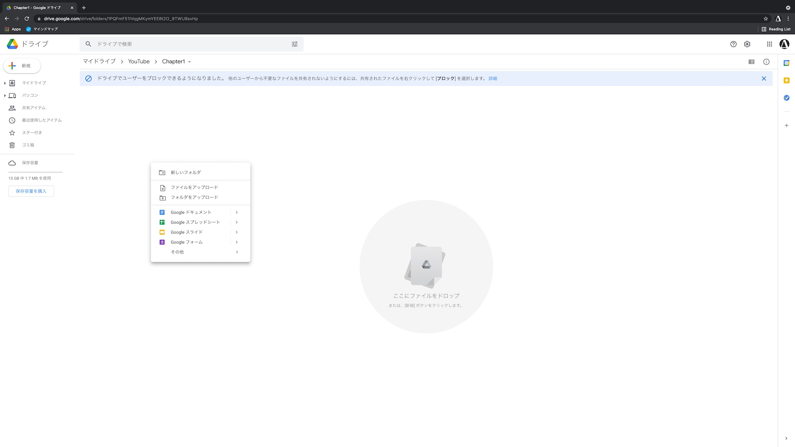
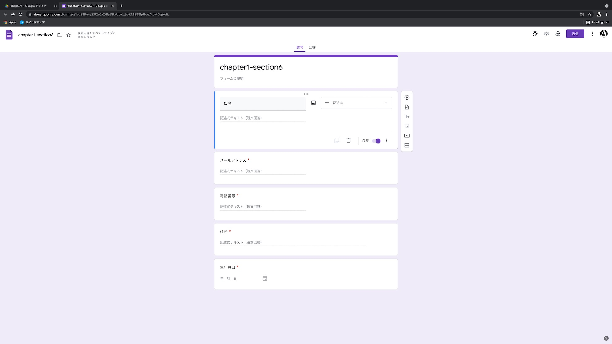
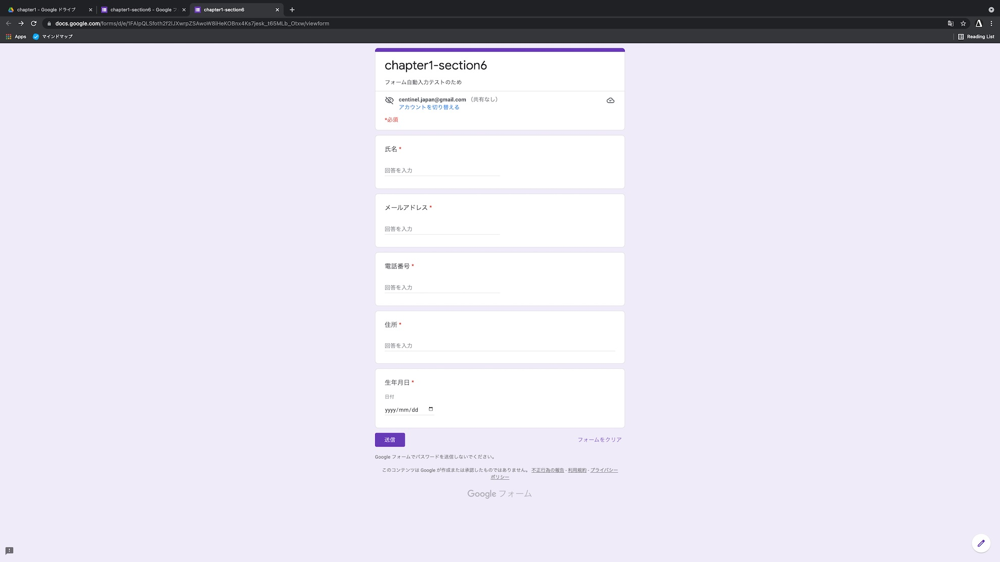
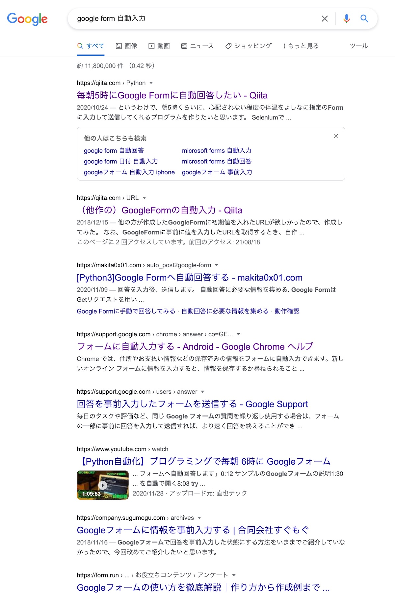
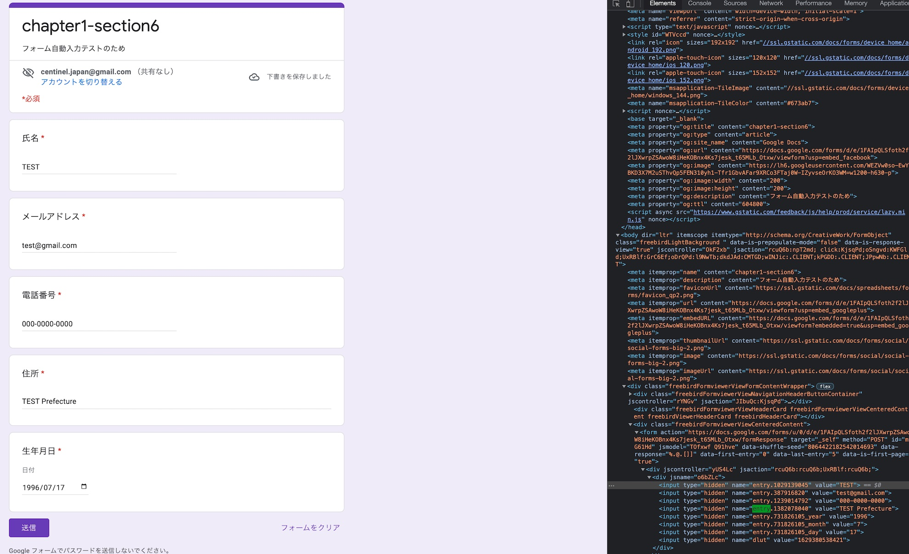
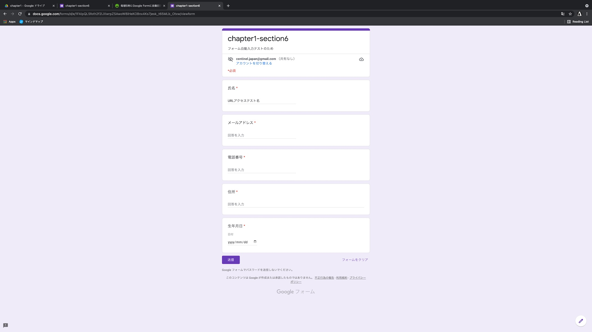

# 第6節 Googleフォームへの入力を自動化しよう

## 1. Googleフォームの準備をする

1. フォームファイルを作成



2. フォームに項目を追加



3. 完成



## 2. 何を実現したいか考える

https://docs.google.com/forms/d/e/1FAIpQLSfoth2f2lJXwrpZSAwoW8iHeKOBnx4Ks7jesk_t65MLb_Otxw/viewform

1. フォームページを開く


2. 情報を入力する


3. 送信ボタンを押す


## 3. 実現方法を調査する



一番上の記事が良さそう

https://qiita.com/kota-yata/items/9d4124ec7a7dd4e3d4f0

### わかったこと

1. Seleniumとかいうものを使ってフォームを送信するらしい
2. Google FormはURLにパラメータを指定することで、初期値を持った状態でフォームを開くことができるらしい
    - `usp=pp_url` をURLパラメータに付与
    - `entry.番号=回答内容` をURLパラメータに付与

## 4. パラメータ付きのフォームを開いてみよう

1. フォーム中身をChromeの開発者ツールを使って覗き、 `entry.番号` の規則性を調べる

```
開発者ツールの開き方

Mac -> CMD + Opt + i
Windows -> Ctrl + Shift + i
```

2. 結果



3. まとめた
```
entry.1029139045 -> 氏名
entry.387916820 -> メールアドレス
entry.1239014792 -> 電話番号
entry.1382078040 -> 住所
entry.731826105_year -> 生年月日の年
entry.731826105_month -> 生年月日の月
entry.731826105_day -> 生年月日の日
```

4. 3をURLに反映してフォームを開いてみよう

フォームのURLとパラメータの間に`?`を入れ、それからは`&`でパラメータを区切っていく

まずは試しに氏名だけ

https://docs.google.com/forms/d/e/1FAIpQLSfoth2f2lJXwrpZSAwoW8iHeKOBnx4Ks7jesk_t65MLb_Otxw/viewform?usp=pp_url&entry.1029139045=URLアクセステスト名




では全部入り

https://docs.google.com/forms/d/e/1FAIpQLSfoth2f2lJXwrpZSAwoW8iHeKOBnx4Ks7jesk_t65MLb_Otxw/viewform?usp=pp_url&entry.1029139045=URLアクセステスト名&entry.387916820=test@gmail.com&entry.1239014792=0000-0000-0000&entry.1382078040=TEST prefecture&entry.731826105_year=1996&entry.731826105_month=7&entry.731826105_day=17

5. 4でできたURLをプログラムから開いてみよう

