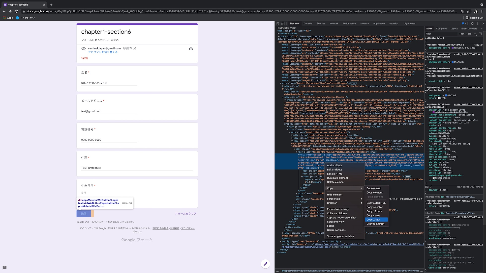

# 第 6 節 Google フォームへの入力を自動化しよう

## 1. Google フォームの準備をする

1. フォームファイルを作成


2. フォームに項目を追加


3. 完成


## 2. 何を実現したいか考える

https://docs.google.com/forms/d/e/1FAIpQLSfoth2f2lJXwrpZSAwoW8iHeKOBnx4Ks7jesk_t65MLb_Otxw/viewform

1. フォームページを開く


2. 情報を入力する


3. 送信ボタンを押す


## 3. 実現方法を調査する


一番上の記事が良さそう

https://qiita.com/kota-yata/items/9d4124ec7a7dd4e3d4f0

### わかったこと

1. Selenium とかいうものを使ってフォームを送信するらしい
2. Google Form は URL にパラメータを指定することで、初期値を持った状態でフォームを開くことができるらしい
   - `usp=pp_url` を URL パラメータに付与
   - `entry.番号=回答内容` を URL パラメータに付与

## 4. パラメータ付きのフォームを開いて

1. フォーム中身を Chrome の開発者ツールを使って覗き、 `entry.番号` の規則性を調べる

```
開発者ツールの開き方

Mac -> CMD + Opt + i
Windows -> Ctrl + Shift + i
```

2. 結果


3. まとめた

```
entry.1029139045 -> 氏名
entry.387916820 -> メールアドレス
entry.1239014792 -> 電話番号
entry.1382078040 -> 住所
entry.731826105_year -> 生年月日の年
entry.731826105_month -> 生年月日の月
entry.731826105_day -> 生年月日の日
```

4. 3 を URL に反映してフォームを開いて

フォームの URL とパラメータの間に`?`を入れ、それからは`&`でパラメータを区切っていく

まずは試しに氏名だけ

https://docs.google.com/forms/d/e/1FAIpQLSfoth2f2lJXwrpZSAwoW8iHeKOBnx4Ks7jesk_t65MLb_Otxw/viewform?usp=pp_url&entry.1029139045=URLアクセステスト名


では全部入り

https://docs.google.com/forms/d/e/1FAIpQLSfoth2f2lJXwrpZSAwoW8iHeKOBnx4Ks7jesk_t65MLb_Otxw/viewform?usp=pp_url&entry.1029139045=URLアクセステスト名&entry.387916820=test@gmail.com&entry.1239014792=0000-0000-0000&entry.1382078040=TEST prefecture&entry.731826105_year=1996&entry.731826105_month=7&entry.731826105_day=17

## 5. 4 でできたURLをプログラムから開いて

```
pip3 install selenium
pip3 install pandas
```

```python
from selenium import webdriver
import time

# フォームのURLを変数で保持する
form_url = 'https://docs.google.com/forms/d/e/1FAIpQLSfoth2f2lJXwrpZSAwoW8iHeKOBnx4Ks7jesk_t65MLb_Otxw/viewform?usp=pp_url&entry.1029139045=URLアクセステスト名&entry.387916820=test@gmail.com&entry.1239014792=0000-0000-0000&entry.1382078040=TEST prefecture&entry.731826105_year=1996&entry.731826105_month=7&entry.731826105_day=17';

# ブラウザを操作するためのインスタンスを生成
driver = webdriver.Chrome()

# ブラウザでフォームを開く
driver.get(form_url)

# 5秒間待つ
time.sleep(5)

# ブラウザを閉じる
driver.close()

# メモリを解放する
driver.quit()
```

## 6. ボタンを押して

### Seleniumでボタンを押させるためには、ボタンの特徴を教えてあげる必要がある
- class
- id
- [xpath](https://www.octoparse.jp/blog/xpath-introduction/) 👈 今回これを利用する

### 開発者ツールからxpathをコピー




### 実行して

```python
from selenium import webdriver
import time

# フォームのURLを変数で保持する
form_url = 'https://docs.google.com/forms/d/e/1FAIpQLSfoth2f2lJXwrpZSAwoW8iHeKOBnx4Ks7jesk_t65MLb_Otxw/viewform?usp=pp_url&entry.1029139045=URLアクセステスト名&entry.387916820=test@gmail.com&entry.1239014792=0000-0000-0000&entry.1382078040=TEST prefecture&entry.731826105_year=1996&entry.731826105_month=7&entry.731826105_day=17';

# ブラウザを操作するためのインスタンスを生成
driver = webdriver.Chrome()

# ブラウザでフォームを開く
driver.get(form_url)

# ボタンを押して送信する
path = '//*[@id="mG61Hd"]/div[2]/div/div[3]/div[1]/div[1]/div' # コピーしたボタンのxpathを貼り付ける
driver.find_element_by_xpath(path).click()

# 5秒間待つ
time.sleep(5)

# ブラウザを閉じる
driver.close()

# メモリを解放する
driver.quit()
```

# 番外編 使いやすくしよう

## 7. ファイルからデータを読み込む

以下のようなデータをCSV形式で用意します
|氏名|メールアドレス|電話番号|住所|年|月|日|
|:----|:----|:----|:----|:----|:----|:----|
|テストタロウ0|test0@gmail.com|0800000000|東京都|1990|1|10|
|テストタロウ1|test1@gmail.com|08011111111|神奈川県|1991|1|11|

### CSVを読み込む

```python
import pandas as pd

# CSVを読み込む
df = pd.read_csv('./data.csv', dtype=str)

# コンソールにプリントして確認してみる
print(df)
```

### 読み取ったCSVを一列ごとに取り出してみる

```python
import pandas as pd

# CSVを読み込む
# 型のヒントを書くことで補完が効くようになる
df: pd.DataFrame = pd.read_csv('./data.csv', dtype=str)

# 一列ごとに処理できる
for index, row in df.iterrows():
    # どのような値が入っているか確認してみる
    print(index)

    # 上の確認ができたら、下のコメントを外してこちらも確認してみる
    # print(row)
```

## 8. 読み取ったデータをURLパラメータに変換する準備を行う

読み取ったデータを辞書型の変数に格納し、その変数をURLパラメータに変換したい。
そのため辞書型の変数からURLパラメータへ変換する関数を実装する。

```python
# パラメータを保持する辞書型の変数
# keyにurlパラメータ名、valueに入る要素名を入れる（valueはわかりやすければ適当な値でも大丈夫）
urlParamDict = {
    'usp': 'pp_url',
    'entry.1029139045': '氏名',
    'entry.387916820': 'メールアドレス',
    'entry.1239014792': '電話番号',
    'entry.1382078040': '住所',
    'entry.731826105_year': '年',
    'entry.731826105_month': '月',
    'entry.731826105_day': '日',
}

def convertDictToUrlParams(params):
    """[summary]

    Args:
        params (Dict): 入力したい値を辞書型で表現した値

    Returns:
        string: paramsをURLパラメータに変換した値
        (例) param1=value1&param2=value2&param3=value3
    """
    paramsString = ''
    for key, value in params.items():
        paramsString += '&' + key + "=" + value
    
    # 最初の「&」を削除している。URLパラメータの最初は「&」ではないため。
    # ここでは「スライス」という機能を使い、"1インデックス"以降の文字を取得している
    # インデックスは0始まりなので、2文字目以降を取得することになる
    return paramsString[1:]

# 期待している値
expect = 'usp=pp_url&entry.1029139045=氏名&entry.387916820=メールアドレス&entry.1239014792=電話番号&entry.1382078040=住所&entry.731826105_year=年&entry.731826105_month=月&entry.731826105_day=日'
actual = convertDictToUrlParams(urlParamDict)

# 期待する値になっているかテストを行う
if expect == actual:
    print("🎉期待する値です🎉")
else:
    print("🥲期待する文字列ではありません🥲")
```


